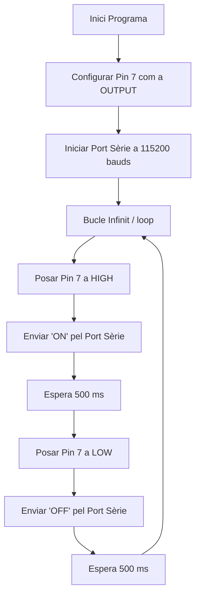
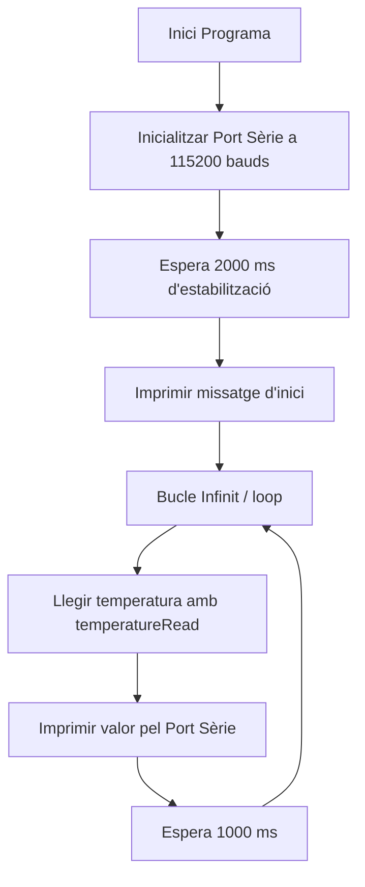
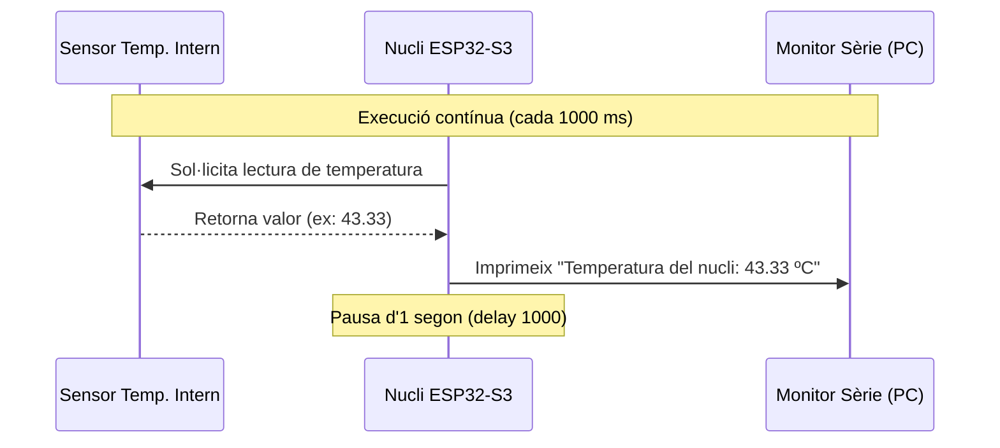
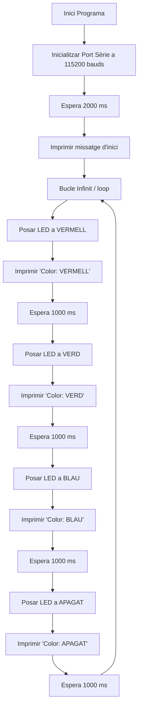

```mermaid
gantt
    title Cronograma LED RGB (Trams d'1 segon)
    dateFormat  s
    axisFormat  %S
   
    section LED RGB
    VERMELL (255, 0, 0) :done,   0, 1
    VERD (0, 255, 0)    :active, 1, 2
    BLAU (0, 0, 255)    :done,   2, 3
    APAGAT (0, 0, 0)    :active, 3, 4
   
    section Port Sèrie
    Enviant VERMELL     :done,   0, 1
    Enviant VERD        :active, 1, 2
    Enviant BLAU        :done,   2, 3
    Enviant APAGAT      :active, 3, 4
```

# Informe de Pràctica 1: Blink
**Autors** Julio Lázaro Alcobendas i Gerard Rodríguez González  
**Data:** 24 de Febrer de 2026  
**Repositori GitHub:** https://github.com/gedrar/Practica-1


---


## 1. Objectius de la pràctica
L'objectiu principal d'aquesta pràctica és aconseguir el parpelleig periòdic
 d'un LED utilitzant un microcontrolador ESP32-S3-DevKitC-1. A més a més, s'utilitza la sortida del port sèrie per monitorar l'estat del LED i facilitar la depuració del programa.


## 2. Desenvolupament i Arquitectura
Per a la realització del projecte, s'ha configurat l'entorn de PlatformIO amb el framework d'Arduino per a la placa ESP32-S3. S'ha connectat un LED al pin 7 de la protoboard.


El funcionament es basa en configurar aquest pin com a sortida digital i establir una comunicació sèrie a 115200 bauds. Dins d'un bucle infinit, s'alternen estats ALTS i BAIXOS al pin del LED, intercalant pauses de 500 mil·lisegons i enviant missatges d'estat ("ON" i "OFF") pel terminal sèrie.


## 3.  Codi Principal (`main.cpp`)
```cpp
#include <Arduino.h>


// Definim el pin del LED connectat a la protoboard.
const int ledPin = 7;


void setup() {
  // 1. Iniciar pin de led com a sortida
  pinMode(ledPin, OUTPUT);
 
  // 2. Iniciar el terminal sèrie
  Serial.begin(115200);
 
  // Petita pausa per estabilitzar el port sèrie
  delay(2000);
  Serial.println("Iniciant Pràctica 1: Blink...");
}


// 3. Bucle infinit
void loop() {
  // Encendre led
  digitalWrite(ledPin, HIGH);
  // Treure per port sèrie missatge ON
  Serial.println("ON");
  // Espera de 500 mil·lisegons
  delay(500);
 
  // Apagar led
  digitalWrite(ledPin, LOW);
  // Treure per port sèrie missatge OFF
  Serial.println("OFF");
  // Espera de 500 mil·lisegons
  delay(500);
}
```
## 4. Funcionament del codi
Primer de tot, indiquem que el nostre LED està connectat físicament al pin número 7 de la placa. Llavors, quan el microcontrolador s'engega, executa una preparació inicial (la funció setup) on configurem aquest pin perquè actuï com a sortida d'energia i obrim el canal de comunicació sèrie, que és el que permetrà que la placa i l'ordinador es puguin enviar missatges de text. Un cop feta aquesta posada a punt, el programa entra en un loop. Bàsicament la placa envia corrent al pin 7 per encendre el LED i, just al mateix temps, envia la paraula "ON" cap a la pantalla de l'ordinador. Seguidament, fa una pausa de mig segon mantenint el llum encès i, passat aquest temps, talla el corrent per apagar-lo, avisa l'ordinador enviant un "OFF" i s'espera mig segon més abans de tornar a començar de nou.


## 5. Sortida pel Monitor Sèrie
```text
Iniciant Pràctica 1: Blink...
ON
OFF
ON
OFF
ON
OFF
...
```
## 6. Codi Especificacions (`platformio.ini`)
```ini
[env:esp32-s3-devkitm-1]
platform = espressif32
board = esp32-s3-devkitm-1
framework = arduino
; Configuració del monitor
monitor_speed = 115200
```
## 7. Diagrama de flux de main.cpp



## 8. Diagrama de temps del senyal al pin 7

## 9. Preguntes de la pràctica:


**En el programa que se ha realizado cual es el tiempo libre que
tiene el procesador ?**
El processador està lliure pràcticament tot el temps, ja que les accions de canviar l'estat del LED i enviar el text per pantalla són molt ràpides. La major part del temps el programa està aturat gràcies al  delay(500). Com que l'ESP32-S3 és intel·ligent, quan veu un delay, no es queda bloquejat sense fer res, sinó que es posa en estat idle  fins que passa el mig segon i ha de tornar a canviar l'estat del LED.


## 10. Conclusions
Aquesta pràctica inicial ens ha permès familiaritzar-nos amb l'entorn de desenvolupament PlatformIO i comprendre l'arquitectura bàsica d'un programa per a microcontroladors (setup i loop). Hem assolit amb èxit la configuració d'un pin digital com a sortida (OUTPUT) per controlar un component físic de maquinari (el LED) i hem pogut establir una comunicació sèrie bidireccional.


# EXERCICI DE MILLORA DE NOTA: Temperatura Interna


## 1. Objectiu
L'objectiu d'aquest exercici és utilitzar el sensor de temperatura intern integrat al microcontrolador ESP32-S3 per monitorar la temperatura del nucli del processador i enviar les dades pel port sèrie.


## 2. Desenvolupament
S'ha creat un programa senzill que utilitza la funció nativa `temperatureRead()`. Aquesta funció fa una lectura directa del sensor de temperatura de maquinari del xip sense necessitat d'utilitzar cap component extern.


## 3. Codi main


```cpp
#include <Arduino.h>


void setup() {
  // Iniciem el terminal sèrie a 115200 baudios
  Serial.begin(115200);
 
  // Petita pausa perquè el port USB de l'S3 s'estabilitzi
  delay(2000);
 
  Serial.println("--- Iniciant lectura de Temperatura Interna ESP32-S3 ---");
}


void loop() {
  // La funció temperatureRead() és nativa de l'ESP32 i retorna els graus Celsius
  float temp_c = temperatureRead();
 
  Serial.print("Temperatura del nucli: ");
  Serial.print(temp_c);
  Serial.println(" ºC");
 
  // Esperem 1 segon abans de fer la següent lectura
  delay(1000);
}
```
## 4. Funcionament codi
El programa comença inicialitzant el port sèrie per permetre la visualització de dades i realitza una pausa inicial de 2 segons (delay(2000)) per assegurar-se que la connexió USB amb l'ordinador s'ha establert correctament. Dins del cicle repetitiu (loop), s'executa la instrucció temperatureRead().
 El valor numèric obtingut es desenllaça i es guarda en una variable de tipus float anomenada temp_c. A continuació, aquest valor s'imprimeix pel monitor sèrie. Finalment, el processador s'atura durant 1 segon (delay(1000)).


## 5. Sortida pel Monitor Sèrie
Un cop pujat el codi a la placa, el monitor sèrie mostra la temperatura actualitzada cada segon:


```text
--- Iniciant lectura de Temperatura Interna ESP32-S3 ---
Temperatura del nucli: 43.33 ºC
Temperatura del nucli: 43.33 ºC
Temperatura del nucli: 44.15 ºC
```


## 6. Diagrama de flux

## 7. Diagrama de temps



## 8. Conclusions
Aquest exercici ens ha servit per explorar els sensors interns i les capacitats natives de maquinari que ofereix la ESP32-S3.


# PRÀCTICA 1 COMPLEMENTÀRIA: Control del LED RGB


## 1. Objectiu
L'objectiu d'aquesta pràctica complementària és posar a prova i controlar el LED RGB integrat (tipus WS2812 / Neopixel) que inclou la placa ESP32-S3-DevKit, alternant els seus colors bàsics.


## 2. Desenvolupament
A diferència d'un LED normal que s'encén o s'apaga amb `digitalWrite()`, aquest LED RGB necessita un protocol de comunicació específic. S'ha adaptat l'esbós `.ino` original per a l'entorn de PlatformIO.
Utilitzant la funció `neopixelWrite()` (inclosa en les versions recents del *framework* d'Arduino per a ESP32), s'ha programat un cicle infinit que canvia el color del LED integrat a la placa (generalment associat al GPIO 48).


## 3. Codi main


```cpp
#include <Arduino.h>


// El LED RGB integrat a les ESP32-S3 sol estar al pin 48 (o al pin de la constant RGB_BUILTIN)
#ifndef RGB_BUILTIN
#define RGB_BUILTIN 48
#endif


void setup() {
  Serial.begin(115200);
  delay(2000);
  Serial.println("--- Test LED RGB Integrat (Neopixel) ---");
}


void loop() {
  // Formato: neopixelWrite(PIN, Vermell, Verd, Blau) - Valors de 0 a 255
 
  Serial.println("Color: VERMELL");
  neopixelWrite(RGB_BUILTIN, 255, 0, 0); // Vermell al màxim
  delay(1000);
 
  Serial.println("Color: VERD");
  neopixelWrite(RGB_BUILTIN, 0, 255, 0); // Verd al màxim
  delay(1000);
 
  Serial.println("Color: BLAU");
  neopixelWrite(RGB_BUILTIN, 0, 0, 255); // Blau al màxim
  delay(1000);
 
  Serial.println("Color: APAGAT");
  neopixelWrite(RGB_BUILTIN, 0, 0, 0); // Apagat
  delay(1000);
}
```


## 4. Funcionament
El programa assigna valors d'intensitat (de 0 a 255) per als tres canals de color (Vermell, Verd, Blau) amb intervals d'un segon.


La seqüència d'estats obtinguda és:
1. S'encén exclusivament el canal Vermell (`255, 0, 0`).
2. S'encén exclusivament el canal Verd (`0, 255, 0`).
3. S'encén exclusivament el canal Blau (`0, 0, 255`).
4. S'apaguen tots els canals (`0, 0, 0`).


Pel terminal sèrie es registra de forma síncrona quin color s'està mostrant en cada moment.


## 5. Sortida pel monitor serie
```text
--- Test LED RGB Integrat (Neopixel) ---
Color: VERMELL
Color: VERD
Color: BLAU
Color: APAGAT
Color: VERMELL
...
```


## 6. Diagrama de flux

## 7. Diagrama de temps

## 8. Conclusions
Amb aquesta pràctica complementària hem après a interactuar amb components electrònics adreçables com és el LED RGB inclòs a la ESP32-S3 sense utilitzar cap component ni llibreria externs.

